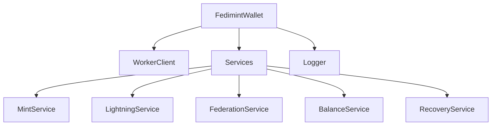

# Core Web Architecture

Docs Page: [Architecture](https://web.fedimint.org/core/architecture.html)

## **Overview**

The Fedimint Web SDK **Core Web** library is a modular and extensible JavaScript library designed to interact with the Fedimint client in a web browser. It provides a high-level API for developers to manage federated e-cash wallets, perform operations like minting and spending e-cash, and interact with the Lightning Network. The library is structured to promote maintainability, scalability, and ease of use, leveraging modern software development practices.

---

## **Core Components**

The architecture of the FedimintWallet library is built around a set of composable services and a communication layer that interacts with a Web Worker running WebAssembly (WASM) code. Below is an outline of the core components:

### **1. FedimintWallet Class**

- **Purpose**: Serves as the main entry point for the library.
- **Responsibilities**:
  - Orchestrates the various services and the WorkerClient.
  - Provides methods to initialize and configure the wallet.
  - Exposes services to the user for performing operations.

### **2. WorkerClient**

- **Purpose**: Manages all communication between the main thread and the Web Worker.
- **Responsibilities**:
  - Initializes and maintains the Web Worker instance.
  - Handles message passing and response callbacks.
  - Provides methods for sending RPC requests and handling streaming responses.
- **Features**:
  - Abstracts worker creation to support both bundler and no-bundler environments.
  - Implements request tracking using a unique request ID system.

### **3. Services**

The library is decomposed into several services, each encapsulating a specific domain of functionality. This modular design allows for easier maintenance and testing.

- **FederationService**: Handles federation-related operations such as joining federations, retrieving configurations, and obtaining invite codes.

- **MintService**: Manages operations related to minting and handling e-cash notes, including redeeming, reissuing, spending, and validating notes.

- **LightningService**: Facilitates interactions with the Lightning Network, handling invoice creation/payment, gateway management, and event subscriptions.

- **BalanceService**: Manages balance inquiries and subscriptions, allowing users to fetch current wallet balance and subscribe to changes.

- **RecoveryService**: Manages recovery operations, including checking for pending recoveries, waiting for completion, and subscribing to progress updates.

## **Utilities**

The library includes a configurable logging utility to aid in development and debugging.

- **Logger Utility**:
  - A `Logger` class supports multiple log levels: `DEBUG`, `INFO`, `WARN`, `ERROR`, and `NONE`.
  - Users can set the desired log level using the `setLogLevel` method.

## **Summary Diagram**

